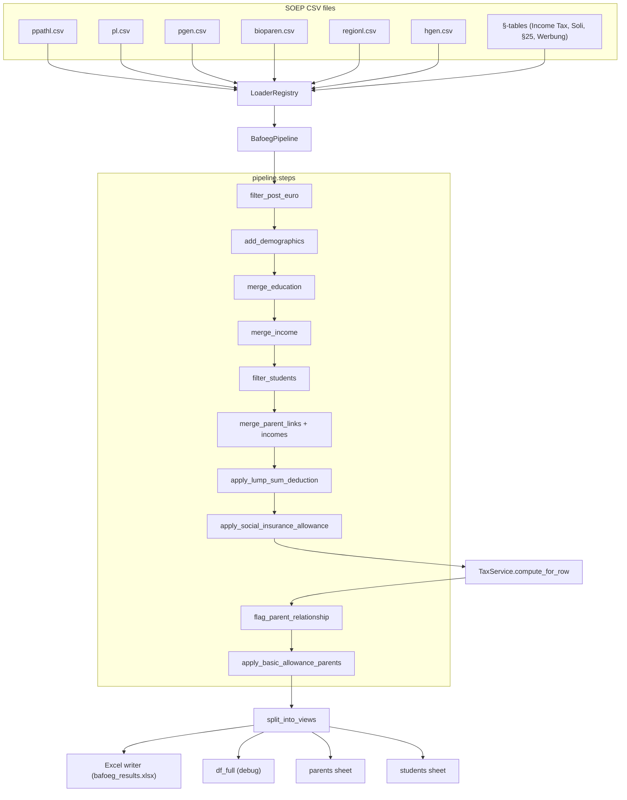

```mermaid
flowchart TD
    %% ─────────────────────────────
    %%  DATA INGEST
    %% ─────────────────────────────
    subgraph "SOEP CSV files"
        PPATHL["ppathl.csv"]
        PL["pl.csv"]
        PGEN["pgen.csv"]
        BIOPAREN["bioparen.csv"]
        REGIONL["regionl.csv"]
        HGEN["hgen.csv"]
        STAT["§-tables (Income Tax, Soli, §25, Werbung)"]
    end

    %% Loader layer
    PPATHL --> LR["LoaderRegistry"]
    PL      --> LR
    PGEN    --> LR
    BIOPAREN--> LR
    REGIONL --> LR
    HGEN    --> LR
    STAT    --> LR

    %% ─────────────────────────────
    %%  PIPELINE
    %% ─────────────────────────────
    LR --> PIPE["BafoegPipeline"]

    subgraph steps["pipeline.steps"]
        FILTER["filter_post_euro"]
        DEMO["add_demographics"]
        EDU["merge_education"]
        INC["merge_income"]
        STFILT["filter_students"]
        PARENTS["merge_parent_links + incomes"]
        WERB["apply_lump_sum_deduction"]
        SOCL["apply_social_insurance_allowance"]
        FLAG["flag_parent_relationship"]
        ALLOW["apply_basic_allowance_parents"]
    end

    PIPE --> FILTER
    FILTER --> DEMO --> EDU --> INC --> STFILT --> PARENTS --> WERB --> SOCL

    %% Tax service
    SOCL --> TAX["TaxService.compute_for_row"]
    TAX --> FLAG --> ALLOW
    ALLOW --> SPLIT["split_into_views"]

    %% ─────────────────────────────
    %%  OUTPUT
    %% ─────────────────────────────
    SPLIT --> XW["Excel writer (bafoeg_results.xlsx)"]
    SPLIT --> FULL["df_full (debug)"]

    %% Worksheet views
    SPLIT --> PVIEW["parents sheet"]
    SPLIT --> SVIEW["students sheet"]
    %% future  SPLIT --> SIB["siblings sheet"]

```
